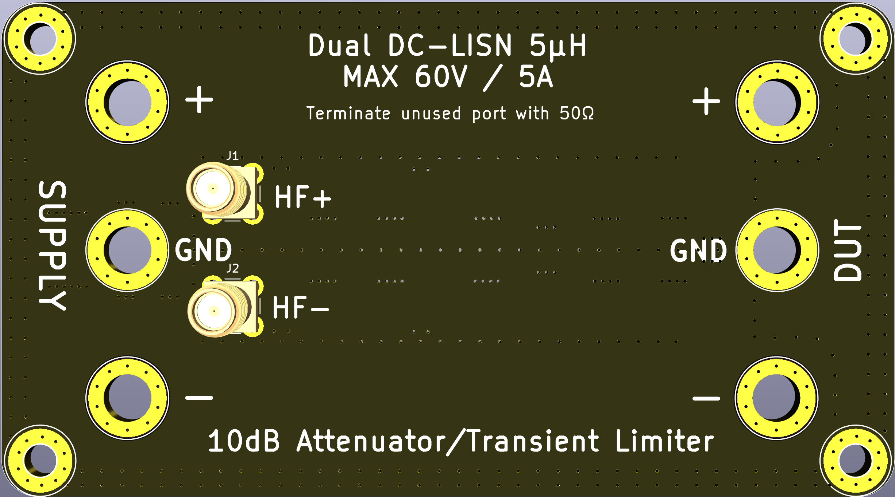
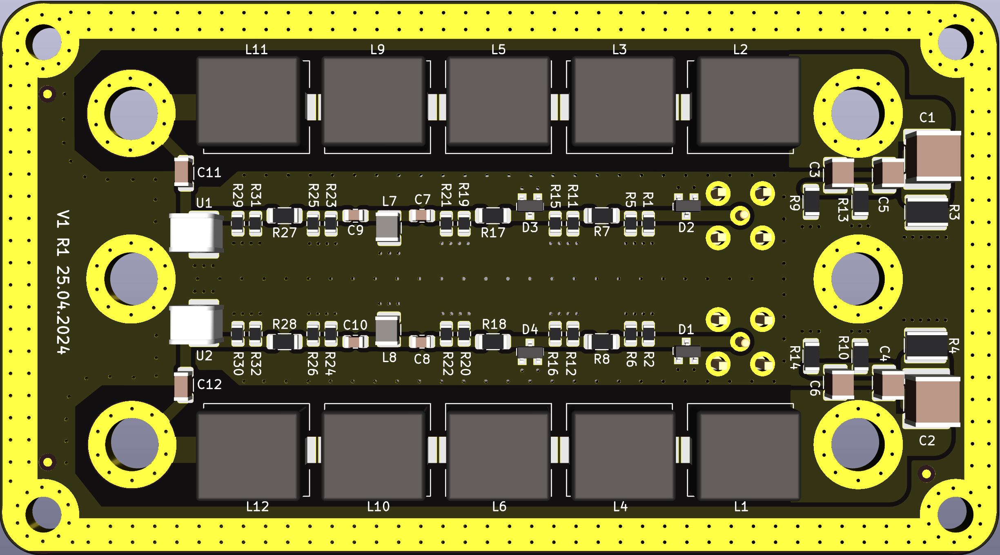

# 5µH LISN(Line Impedance Stabilization Network)

Open Source Hardware Dual 5µH DC LISN with 10dB Attenuator and Transient Limiter for Spectrum Analyzer EMC work.

A LISN is a [Line Impedance Stabilization Network](https://en.wikipedia.org/wiki/Line_Impedance_Stabilization_Network) used in conducted emissions testing.

The AIM of this Dual LISN is to be used for EMC pre-testing with frequency range 30kHz(or lower) to 110MHz(or up to 150MHz or more).

Fork from the [original project](https://github.com/bvernoux/EMC_5uH_LISN), the main changes are made the following:

* Convert project to [KiCad 8.0](https://www.kicad.org) version
* Added [KiBot](https://github.com/INTI-CMNB/KiBot) configuration, for automated generation of the documentation
* Improvement in this design: 
  * Replace Keystone 575-8 by screwed type Chinese alternative
  * Inductors are replaced by more affordable (need to make some tests)
  * BOM changes for cheaper Chinese alternatives
  * Another case (Gainta) is chosen

This work is heavily based on work from others mainly **Jay_Diddy_B** & **Noy** from EEVBLOG forum.

See all links related to the original Dual 5µH LISN:
* https://www.eevblog.com/forum/projects/5uh-lisn-for-spectrum-analyzer-emcemi-work/75/
* https://www.eevblog.com/forum/projects/5uh-lisn-for-spectrum-analyzer-emcemi-work/msg3420102/#msg3420102

Video related to EMC Conducted Emissions / LISN:
* Rohde Schwarz video Understanding LISNs: 
  * This video explains the design and function of a LISN (line impedance stabilization network) and how LISNs are used in conducted EMC testing.
  * https://www.youtube.com/watch?v=QPJzp66Yvzs
* EMC Conducted Emissions: How to connect and set up a LISN:
  * In this video Dr. Ali Shirsavar shows how you can connect and set up a LISN ready for pre-compliance testing of EMC conducted emissions.
  * https://www.youtube.com/watch?v=28oDdL9RnWM
